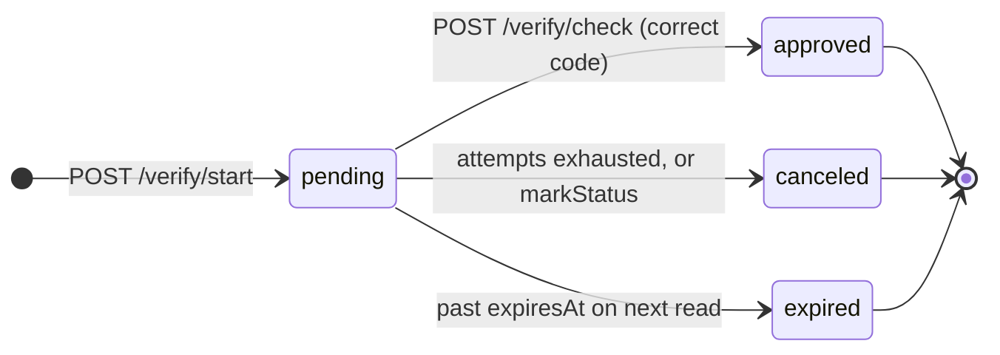

# nestjs-verify

Self-hosted OTP for NestJS, in the shape of Twilio Verify. One POST starts a verification, another checks the code. Code generation, TTL, attempt caps, cooldowns, rate limits, and abuse heuristics live in the library. You pick the SMS provider and the stores.

## Migrating from 0.2.x to 0.3.0

0.3.0 is a breaking change. The library no longer depends on `@nestjs/cache-manager`. State is now organized behind five store interfaces, with one adapter per backend.

```diff
- import { CacheModule } from '@nestjs/cache-manager';
- import { MemoryVerifyStore, MemoryAbuseStore } from '@jadedm/nestjs-verify';
+ import { createMemoryStores } from '@jadedm/nestjs-verify';

  @Module({
    imports: [
-     CacheModule.register({ isGlobal: true }),
      VerifyModule.forRoot({
        sms: { provider: ... },
-       stores: {
-         verify: new MemoryVerifyStore(),
-         abuse:  new MemoryAbuseStore(),
-       },
+       stores: createMemoryStores(),
      }),
    ],
  })
```

For production, the migration is a single factory call per backend:

```ts
import { createPostgresStores } from '@jadedm/nestjs-verify-postgres';
const stores = await createPostgresStores({ connectionString });
VerifyModule.forRoot({ sms: { provider }, stores });
```

The factory runs idempotent migrations under an advisory lock. Existing `verifications` and `verify_abuse_log` tables are unchanged. Three new tables are created on first start: `verify_rate_limits`, `verify_cooldowns`, `verify_phone_index`. Mongo gets equivalent collections with TTL indexes.

The wire shape of `/verify/start` and `/verify/check` is unchanged. The only newly-surfaced wire field is `retryAfterMs` on 429 cooldown responses.

## Install

```bash
pnpm add @jadedm/nestjs-verify
pnpm add @jadedm/nestjs-verify-twilio
pnpm add @jadedm/nestjs-verify-postgres     # or -mongo, or -redis for ephemeral
```

## Packages

| Package | Purpose |
|---|---|
| [`@jadedm/nestjs-verify`](./packages/core) | Core module, service, five store interfaces, in-memory stores, mock SMS provider |
| [`@jadedm/nestjs-verify-twilio`](./packages/provider-twilio) | Twilio SMS provider adapter with transient-error retry |
| [`@jadedm/nestjs-verify-gupshup`](./packages/provider-gupshup) | Gupshup SMS provider adapter (India and SEA market) |
| [`@jadedm/nestjs-verify-postgres`](./packages/store-postgres) | All five stores against Postgres. Atomic ops, migration runner with advisory lock |
| [`@jadedm/nestjs-verify-mongo`](./packages/store-mongo) | All five stores against Mongo. Atomic ops via aggregation pipelines, TTL indexes |
| [`@jadedm/nestjs-verify-redis`](./packages/store-redis) | Three ephemeral stores against Redis. Atomic INCR via Lua. Pair with a durable store. |

All packages publish independently to npm and version in lockstep via Changesets.

## Quickstart

```ts
import { Module } from '@nestjs/common';
import {
  VerifyModule,
  MockSmsProvider,
  createMemoryStores,
} from '@jadedm/nestjs-verify';

@Module({
  imports: [
    VerifyModule.forRoot({
      sms: { provider: new MockSmsProvider() },
      stores: createMemoryStores(),
      code: { fixedCode: '123456' },     // dev only; loud warning at boot
    }),
  ],
})
export class AppModule {}
```

```bash
curl -X POST http://localhost:3000/verify/start \
  -H 'Content-Type: application/json' \
  -d '{"to":"+14155552671"}'
# 201 {"sid":"vr_...","state":"pending","channel":"sms","expiresAt":"..."}

curl -X POST http://localhost:3000/verify/check \
  -H 'Content-Type: application/json' \
  -d '{"to":"+14155552671","code":"123456"}'
# 201 {"sid":"vr_...","state":"approved","attemptsRemaining":0}
```

For production, swap `MockSmsProvider` for `TwilioSmsProvider` and `createMemoryStores()` for `await createPostgresStores({ connectionString })` (or `createMongoStores`, or a mix with `createRedisStores` for the ephemeral half).

## State machine



A verification is created in `pending`. It transitions exactly once, to `approved`, `canceled`, or `expired`. The wire representation calls the field `state`, distinct from JSend-style envelope `status`.

## Comparison with Twilio Verify

| | Twilio Verify | `@jadedm/nestjs-verify` |
|---|---|---|
| Code generation | Twilio | Library (`crypto.randomInt`) |
| Code storage | Twilio's tenant | Your database, salted SHA-256 |
| Attempt cap, cooldown, rate limits | Built in | Built in |
| Fraud Guard | Built in | Basic velocity check, pluggable |
| Channel fallback | SMS, voice, email, WhatsApp | SMS today; channels listed in `VerificationChannel`, only SMS dispatched |
| Pricing at scale | ~$0.05 per verification on top of SMS | Cost of your SMS provider only |
| Provider lock-in | Twilio | Choose: Twilio today, more later |
| Data residency | Twilio's regions | Wherever your DB runs |
| DLR / delivery feedback | Built in | Not yet (see [Maturity](./packages/core/README.md#maturity-and-limitations)) |
| SOC 2 evidence | Inherited from Twilio | Your responsibility |

The trade-off is honest: you trade Twilio's compliance and managed surface for control, lower per-verify cost, and the ability to swap SMS providers without changing application code.

## Maturity

Beta. The cryptographic primitives are sound and the store atomicity is correct. The library is missing several features expected of enterprise compliance environments. Read [the full maturity and limitations section](./packages/core/README.md#maturity-and-limitations) in the core package README before adopting.

## Local development

```bash
pnpm install
pnpm build
pnpm test                # unit tests across all packages
pnpm test:adapters       # live integration smoke against Postgres + Mongo (needs Docker)
pnpm --filter basic-twilio-postgres start
```

The runnable example in `examples/basic-twilio-postgres` wires the core, the Twilio provider, and the Postgres store together.

`pnpm test:adapters` spins up Postgres 16 and Mongo 7 in Docker, runs the adapter contract script in `scripts/smoke-adapters.mjs`, and tears the containers down. It is the safest pre-release check for any change that touches a store adapter. See `scripts/README.md` for details.

## Releases

Each package versions independently via [Changesets](https://github.com/changesets/changesets) with a `linked` group keeping core and adapters in lockstep. The release workflow uses npm Trusted Publishing (OIDC); no NPM_TOKEN is needed in CI once trusted publishers are configured per package on npmjs.com.

To propose a change:

```bash
pnpm changeset       # describe the change, pick affected packages and bump type
git commit -am "..."
git push
# A "Version Packages" PR opens automatically; merging it publishes.
```

## Consulting

If you need integration help, custom provider or store adapters, NestJS architecture review, or fractional CTO support shipping this into production, see [manishj.com](https://manishj.com).

## License

MIT. Manish Jadhav ([@jadedm](https://github.com/jadedm)).
