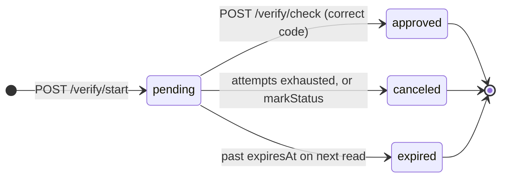

# nestjs-verify

Self-hosted OTP for NestJS, in the shape of Twilio Verify. One POST starts a verification, another checks the code. Code generation, TTL, attempt caps, cooldowns, rate limits, and abuse heuristics live in the library. You pick the SMS or email provider and the stores.

## Upgrading to 0.7.0

0.7.0 is a breaking change for custom stores only. The shipped memory, Postgres, Mongo and Redis stores already implement the new methods.

- `CooldownStore` gains `claim(key, seconds, holder)` and `release(key, holder)`. `start` claims the cooldown atomically before it sends, so simultaneous starts for one recipient send one code; the others get `COOLDOWN_ACTIVE`.
- `PhoneIndexStore` gains `deleteIfMatches(phone, sid)`. Cleanup removes a recipient's index entry only while it still points at that verification, so it can no longer remove a newer one.
- `VerifyService` refuses, when it is constructed, a store that lacks any of these methods.
- Postgres: migration 3 adds a `holder` column to `verify_cooldowns`. `createPostgresStores` applies it on start; with `skipSchemaSetup`, apply it from the exported `MIGRATIONS` before upgrading.
- A second `check` of an expired, locked-out or finished verification now answers `NO_PENDING_VERIFICATION` instead of `canceled`, as it already did after an approval.

The changelogs in each package carry the details.

## Migrating from 0.2.x to 0.3.0

0.3.0 is a breaking change. The library no longer depends on `@nestjs/cache-manager`. State is now organized behind five store interfaces, with one adapter per backend.

```diff
- import { CacheModule } from '@nestjs/cache-manager';
- import { MemoryVerifyStore, MemoryAbuseStore } from '@jadedm/nestjs-verify';
+ import { createMemoryStores } from '@jadedm/nestjs-verify';

  @Module({
    imports: [
-     CacheModule.register({ isGlobal: true }),
      VerifyModule.forRoot({
        sms: { provider: ... },
-       stores: {
-         verify: new MemoryVerifyStore(),
-         abuse:  new MemoryAbuseStore(),
-       },
+       stores: createMemoryStores(),
      }),
    ],
  })
```

For production, the migration is a single factory call per backend:

```ts
import { createPostgresStores } from '@jadedm/nestjs-verify-postgres';
const stores = await createPostgresStores({ connectionString });
VerifyModule.forRoot({ sms: { provider }, stores });
```

The factory runs idempotent migrations under an advisory lock. Existing `verifications` and `verify_abuse_log` tables are unchanged. Three new tables are created on first start: `verify_rate_limits`, `verify_cooldowns`, `verify_phone_index`. Mongo gets equivalent collections with TTL indexes.

The wire shape of `/verify/start` and `/verify/check` is unchanged. The only newly-surfaced wire field is `retryAfterMs` on 429 cooldown responses.

## Install

```bash
pnpm add @jadedm/nestjs-verify
pnpm add @jadedm/nestjs-verify-twilio
pnpm add @jadedm/nestjs-verify-postgres     # or -mongo, or -redis for ephemeral
```

## Packages

| Package | Purpose |
|---|---|
| [`@jadedm/nestjs-verify`](./packages/core) | Core module, service, five store interfaces, in-memory stores, mock SMS and email providers |
| [`@jadedm/nestjs-verify-twilio`](./packages/provider-twilio) | Twilio SMS provider adapter with transient-error retry |
| [`@jadedm/nestjs-verify-gupshup`](./packages/provider-gupshup) | Gupshup SMS provider adapter (India and SEA market) |
| [`@jadedm/nestjs-verify-ses`](./packages/provider-ses) | Amazon SES email provider adapter |
| [`@jadedm/nestjs-verify-postgres`](./packages/store-postgres) | All five stores against Postgres. Atomic ops, migration runner with advisory lock |
| [`@jadedm/nestjs-verify-mongo`](./packages/store-mongo) | All five stores against Mongo. Atomic ops via aggregation pipelines, TTL indexes |
| [`@jadedm/nestjs-verify-redis`](./packages/store-redis) | Three ephemeral stores against Redis. Atomic INCR via Lua. Pair with a durable store. |

All packages publish independently to npm and version via Changesets. Each adapter names the core versions it supports in its `peerDependencies`.

## Quickstart

```ts
import { Module } from '@nestjs/common';
import {
  VerifyModule,
  MockSmsProvider,
  createMemoryStores,
} from '@jadedm/nestjs-verify';

@Module({
  imports: [
    VerifyModule.forRoot({
      sms: { provider: new MockSmsProvider() },
      stores: createMemoryStores(),
      code: { fixedCode: '123456' },     // dev only; loud warning at boot
    }),
  ],
})
export class AppModule {}
```

```bash
curl -X POST http://localhost:3000/verify/start \
  -H 'Content-Type: application/json' \
  -d '{"to":"+14155552671"}'
# 201 {"sid":"vr_...","state":"pending","channel":"sms","expiresAt":"..."}

curl -X POST http://localhost:3000/verify/check \
  -H 'Content-Type: application/json' \
  -d '{"to":"+14155552671","code":"123456"}'
# 201 {"sid":"vr_...","state":"approved","attemptsRemaining":0}
```

For production, swap `MockSmsProvider` for `TwilioSmsProvider` and `createMemoryStores()` for `await createPostgresStores({ connectionString })` (or `createMongoStores`, or a mix with `createRedisStores` for the ephemeral half).

## Email codes

Configure `email` alongside or instead of `sms`, then start with `channel: 'email'`:

```ts
import { SesEmailProvider } from '@jadedm/nestjs-verify-ses';

VerifyModule.forRoot({
  email: {
    provider: new SesEmailProvider({ from: 'no-reply@example.com', region: 'ap-south-1' }),
    subject: 'Your sign-in code',
  },
  stores: createMemoryStores(),
});
```

```bash
curl -X POST http://localhost:3000/verify/start \
  -H 'Content-Type: application/json' \
  -d '{"to":"admin@example.com","channel":"email"}'
```

`check` takes the address in `to` as for a phone. The whole address is lowercased for cooldowns, rate limits and lookup, so case variants of one mailbox share them; the code is sent to the address as given. The IP velocity check counts addresses as it counts phones. Provider errors have the address replaced with `[recipient]` before they are logged. Plus-addressing and provider-specific dot rules (`a+1@gmail.com`, `a.b@gmail.com`) are not folded, so each is its own key; the per-IP limits still apply. A failed email send returns `SMS_DISPATCH_FAILED`, the same code as a failed SMS. Store fields named `phone` hold the address. `MockEmailProvider` logs instead of sending, for development and tests.

## State machine


```mermaid
stateDiagram-v2
    direction LR
    [*] --> pending: POST /verify/start
    pending --> approved: POST /verify/check (correct code)
    pending --> canceled: attempts exhausted, or markStatus
    pending --> expired: past expiresAt on next read
    approved --> [*]
    canceled --> [*]
    expired --> [*]
```

A verification is created in `pending`. It transitions exactly once, to `approved`, `canceled`, or `expired`. The wire representation calls the field `state`, distinct from JSend-style envelope `status`.

## Comparison with Twilio Verify

| | Twilio Verify | `@jadedm/nestjs-verify` |
|---|---|---|
| Code generation | Twilio | Library (`crypto.randomInt`) |
| Code storage | Twilio's tenant | Your database, salted SHA-256 |
| Attempt cap, cooldown, rate limits | Built in | Built in |
| Fraud Guard | Built in | Basic velocity check, pluggable |
| Channels | SMS, voice, email, WhatsApp | SMS and email; voice and WhatsApp are rejected with `CHANNEL_NOT_SUPPORTED` |
| Pricing at scale | ~$0.05 per verification on top of SMS | Cost of your SMS or email provider only |
| Provider lock-in | Twilio | Choose: Twilio or Gupshup for SMS, SES for email, or your own |
| Data residency | Twilio's regions | Wherever your DB runs |
| DLR / delivery feedback | Built in | Not yet (see [Maturity](./packages/core/README.md#maturity-and-limitations)) |
| SOC 2 evidence | Inherited from Twilio | Your responsibility |

The trade-off is honest: you trade Twilio's compliance and managed surface for control, lower per-verify cost, and the ability to swap SMS providers without changing application code.

## Maturity

Beta. The cryptographic primitives are sound and the store atomicity is correct. The library is missing several features expected of enterprise compliance environments. Read [the full maturity and limitations section](./packages/core/README.md#maturity-and-limitations) in the core package README before adopting. The work towards 1.0, and the decisions still open, are tracked in [#89](https://github.com/jadedm/nestjs-verify/issues/89).

## Local development

```bash
pnpm install
pnpm build
pnpm test                # unit tests across all packages
pnpm test:adapters       # live adapter smoke against Postgres, Mongo and Redis (needs Docker)
pnpm test:adapters:mongo-drivers   # the Mongo smoke under mongodb 5.0.0, 5.x and 6.x
pnpm --filter basic-twilio-postgres start
```

The runnable example in `examples/basic-twilio-postgres` wires the core, the Twilio provider, and the Postgres store together.

`pnpm test:adapters` spins up Postgres 16, Mongo 7 and Redis 7 in Docker, runs the adapter contract script in `scripts/smoke-adapters.mjs`, and tears the containers down. It is the safest pre-release check for any change that touches a store adapter. See `scripts/README.md` for details.

## Releases

Each package versions independently via [Changesets](https://github.com/changesets/changesets). A `linked` group keeps core, Twilio, Postgres and SES on the same version when they release together; Gupshup, Mongo and Redis version on their own. The release workflow is built for npm Trusted Publishing (OIDC), which needs no NPM_TOKEN once trusted publishers are configured per package on npmjs.com.

To propose a change:

```bash
pnpm changeset       # describe the change, pick affected packages and bump type
git commit -am "..."
git push
# A "Version Packages" PR opens automatically.
```

For now the packages are published by hand after that PR merges, with `scripts/publish-manual.sh`; CI publishing waits on trusted publishers being set up on npmjs.com ([#19](https://github.com/jadedm/nestjs-verify/issues/19)).

## License

MIT. Manish Jadhav ([@jadedm](https://github.com/jadedm)).

---

Built by [Manish Jadhav](https://manishj.com).

Need something like this designed or built? [Inoltro](https://inoltro.ai) is my studio.
